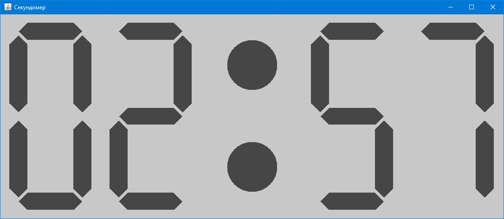

# Stopwatch
Простой секундомер на Java

Попытка реализовать простой секундомер на Java с табло, стилизованным под цифровые индикаторы электронных часов и калькуляторов

Табло выполнено в виде отдельного компонента, наследующего от JPanel. Для отрисовки цифр используется класс NumberMaker, статический метод которого возвращает массив полигонов, описавающих отдельные сегменты, из которых состоит та или иная цифра. Для представления отдельного сегмента используется класс PolygonCoords.

